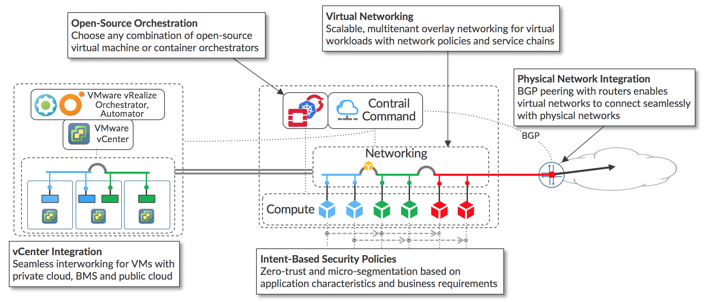
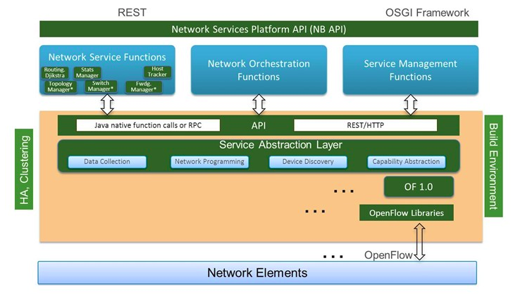
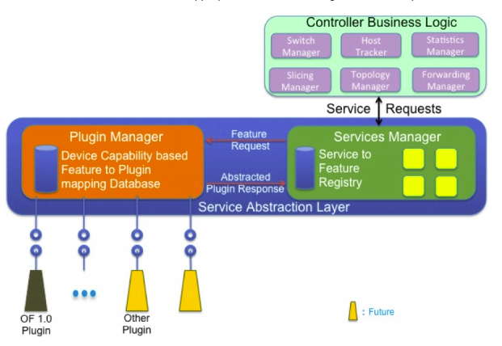

# Tungsten Fabric 

Tungsten Fabric cung cấp một nền tảng mạng ảo hoạt động với nhiều VM và container, tích hợp mạng vật lý với hạ tầng tính toán. Tungsten Fabric sử dụng mạng theo chuẩn BGP EVPN control plane và VXLAN overlay kết nối liền mạch các workload trong các orchestrator khác nhau. 

Tungsten Fabric cung cấp một nền tảng mang ảo có khả năng mở rộng lớn, được thiết kế hỗ trợ multi-tenant network trong môi trường lớn, hỗ trợ đồng thời nhiều orchestrator.

## Use Cases

Các trường hợp sử dụng
- Cho phép Platfor-as-a-Service và Software-as-a-Service với khả năng mở rộng cao và mềm dẻo với datacenter quản lý bởi OpenStack
- Virtual networking với hệ thống quản lý container Kubernete
- Cho phép môi trường ảo mới hoặc đã có chạy VMware vCenter sử dụng Tungsten Fabric virtual networking giữa các VM
- Kết nối Tungsten Fabric virtual network với mạng vật lý sử dụng gateway router với BGP peering và overlay network, trực tiếp qua mạng của data center
Các feature chính được minh hoạ 

## Key Features of Tungsten Fabric 

Tungsten Fabric quản lý và thực hiện virtual networking trong môi trường cloud sử dụng orchestrator là  OpenStack hoặc Kubernete. Tungsten Fabric sử dụng overlay network giữa các vRouter chạy trên mỗi host. Tungsten Fabric cung cấp các tính năng tăng cường so với native networking:
- Khả năng mở rộng cao, multi-tenant newtworking
- Multi-tenant IP address management
- DHCP, ARP proxy để tránh flooding tới mạng 
- Efficient edge replication cho broadcast và multicast
- Local, per-tenant DNS resolution
- Distributed firewall với access control list
- Chính sách bảo mật dựa theo ứng dụng
- Distributed load balancing thông qua các host
- Network address translation (1:1 floating IPs và distributed SNAT)
- Service chaining với virtual network function (VNF)
- Dual stack IPv4 và IPv6
- BGP peering với gateway router
- BGP as a Service (BGPaaS) phân tán các route giữa các hệ thống private và nhà cung cấp dịch vụ

# How Tungsten Fabric Works 

## Tungsten Fabric Working with An Orchestrator

Tungsten Fabric controller kết hợp hệ thống quản lý cloud như OpenStack hoặc Kubernete. TF đảm bảo VM hoặc container khi được tạo được kết nối theo chính sách mạng và bảo mật được chỉ định bởi controller hoặc orchestrator.

Tungsten Fabric gồm hai phần
- *Tungsten Fabric Controller*: tập dịch vụ phần mềm chứa mô hình của mạng và chính sách mạng
- *Tungsten Fabric vRouter*: được cài đặt trên mỗi host chạy các workload (VM or container), thực hiện xử lý chuyển tiếp packet, thực hiện chính sách mạng và bảo mật

Mô hình triển khai thông thường của Tungsten Fabric được thể hiện hình sau

TF controller tích hợp với orchestrator thông qua plugin thực hiện dịch vụ mạng của orchestrator (neutron API, kube-network-manager, container network interface). TF vRouter thay thế Linux bridge và IP tables trên compute host, controller cấu hình vRouter để thực hiện toàn bộ chính sách mạng và bảo mật.

Packet từ VM trên một host tới VM trên host khác được đóng gói MPLS over UDP/GRE hoặc VXLAN, trong đó đích của tiêu đề bên ngoài là địa chỉ IP của host chứa VM đích. Controller có trách nhiệm thiết lập các route trong mỗi VRF của mỗi vRouter thực hiện chính sách mạng. Mặc định VM trong cùng mạng mới giao tiếp được với nhau, các VM trên các mạng khác nhau chỉ giao tiếp được với nhau trừ khi được cho phép bởi chính sách mạng. Controller vaf vRouter giao tiếp với nhau thông qua XMPP một messaging protocol.

## Interaction With An Orchestrator 

Kiến trúc của Tungsten Fabric controller và vRouter, và tương tác với orchestrator

Mỗi interface của workload chạy trên host kết nối tới một VRF chứa L2, L3 forwarding. vRouter thực hiện Integrated Bridgine and Routing (IRB) chức năng của router vật lý. Một vRouter chỉ có các VRF cho mạng mà có interface trên host, gồm Fabric VRF kết nối tới physical interface của host. Logical flow cấu hình network trên VM mới với 1 interface như sau:
1. Chính sách mạng và bảo mật được xác định bởi cả orchestrator và TF sử dụng UI, CLI hoặc REST API. Một mạng được xác định sẽ được gán cho VM interface
2. User orchestrator yêu cầu tạo VM 
3. Orchestrator chọn host cho VM, hướng dẫn compute agent trên máy host fetch image và start VM.
4. TF plugin nhận event hoặc API call từ networking service của orchestrator, set up network cho VM interface. Những hướng dẫn này được chuyển thành TF Rest call và gửi đến TF controller.
5. TF controller gửi request tới vRouter agent cho VM interface để connect tới virtual network chỉ định. vRouter agent hướng dẫn vRouter Forwarder để connect VM interface tới VRF cho virtual network.
6. Compute agent start VM, được cấu hình địa chỉ IP cho các interface VM bằng DHCP. vRouter nhận DHCP request và phản hồi với địa chỉ IP của interface, default gateway và địa chỉ DNS server.
7. Khi interface active và có địa chỉ IP từ DHCP, vRouter cài đặt các đường đi tới IP và MAC của VM với next hop của VM virtual interface.
8. vRouter chỉ định label cho interface và cài đặt label route trong MPLS table. vRouter gửi XMPP message tới controller chứa đường đi tới VM. Route chứa next hop của IP máy chủ chứa  vRouter, chỉ định phương thức đóng gói sử dụng label vừa được chỉ định.
9. Controller phân tán đường đi đến VM tới các vRouter khác với các VM trong cùng mạng hoặc khác mạng được cho phép bởi chính sách mạng.
10. Controller gửi các đường đi đến các VM khác được cho phép bởi policy, tới vRouter của VM. 

# OpenDaylight

OpenDaylight (ODL) là một platform module mở cho phép tuỳ chỉnh và tự động hoá mạng với bất kỳ kích thước quy mô. OpenDaylight phát triển từ phong trào SDN, tập trung vào khả năng lập trình mạng.

## Architecture 

Controller cung cấp Northbound API được sử dụng bởi ứng dụng. ODL hỗ trợ ÓGi framework và API hai chiều. OSGI framework được sử dụng bởi ứng dụng chạy trên địa chỉ của Controller trong khi REST API được sử dụng bởi Apps không chạy cùng không gian địa chỉ với Controller.

## Service Abstraction Layer

Service Abstraction Layer là trung tâm của module của Controller và cho phép hỗ trợ nhiều giao thức và cung cấp dịch vụ nhất quán cho các module và App.

OSGi framework cho phép các plugin liên kết với các giao thức đang phát triển. SAL cung cấp các service cơ bản như Device Discovery sử dụng bởi Topology Manager để xây dựng topology và khả năng của các device. Service được xây dựng bằng cách sử dụng các feature của plugin. Các plugin độc lập với nhau và kết nối với SAL
- Topology Service: tập các service cho phép truyền đạt thông tin topology như new node, new link
- Data Packet service: khả năng cung cấp cho các ứng dụng các packet đến từ agent
- Flow Programing service: cung cấp logic cần thiết để lập trình trong các agent khác nhau
- Statistics service cung cấp API thu thập số liệu thống kê với mỗi: flow, node connector, queue 
- Inventory service: cung cấp API xác định thông tin về node, node connector
- Resource service: cho phép truy vấn trạng thái tài nguyên 

## Tài liệu tham khảo
[Tungsten Fabric doc](https://tungstenfabric.github.io/website/Tungsten-Fabric-Architecture.html)
[OpendayLight doc](https://wiki.opendaylight.org/view/OpenDaylight_Controller:Architectural_Framework) 
