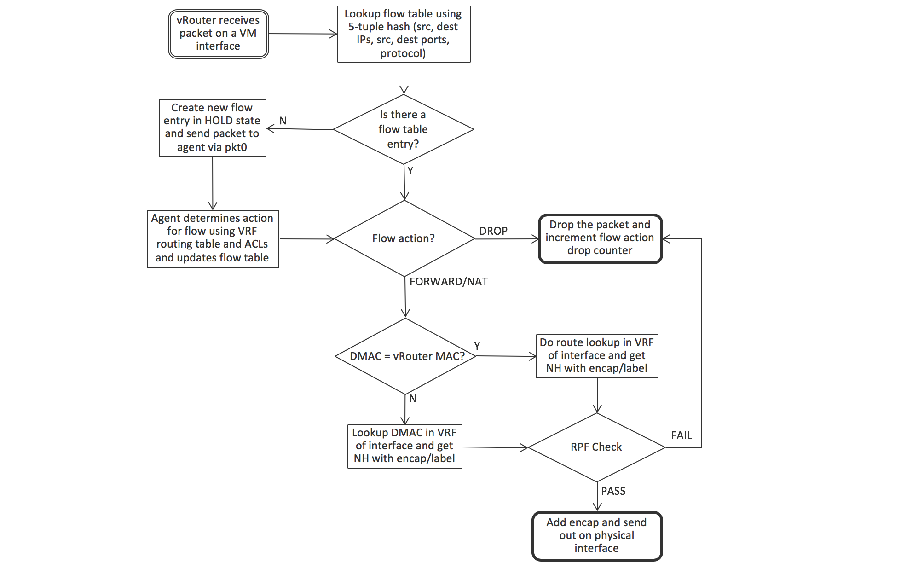
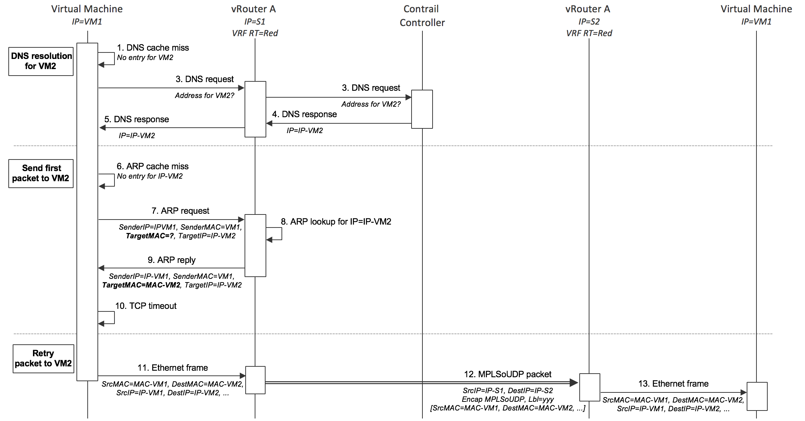

# vRouter
Tungsten Fabric vRouter được cài đặt trên mỗi host chạy workloads (VM hoặc container), vRouter xử lý chuyển tiếp packet, thực hiện chính sách mạng và bảo mật.

## Architecture

vRouter giao tiếp với controller thông qua XMPP (một messaging protocol). vRouter thực hiện IRB (Integrated Bridgine and Routing) chức năng của router vật lý. 
vRouter gồm 2 thành phần: vRouter Agent và vRouter Forwarder kết nối với nhau qua ptk0. vRouter chạy trên mỗi host, kết nối với Tungsten Fabric qua overlay network
- vRouter agent chứa một session với controller và gửi thông tin về VRFs,các route, access control list (ACLs). vRouter lưu trữ thông tin trên database của nó, và sử dụng thông tin đó để cấu hình vRouter Forwarder, vRouter chạy trên user space của máy host.
- vRouter Forwarder chạy như một kernel module trong user space khi DPDK được sử dụng, hoặc trong một network interface card có thể lập trình "smart NIC", vRouter Forwarder chứa MPLS và VXLAN table và các VRF, Fabric VRF
  - MPLS table: chứa label chỉ định bởi vRouter khi VM interface up, chỉ mang tính cục bộ trên vRouter, được match với interface để chuyển tiếp gói tin MPLS dựa vào label tới các VM 
  - VXLAN table: mapping VNI (VXLAN Identife) với VRF để chuyển tiếp gói tin VXLAN tới các VM
  - VRF : chứa flow table và forwarding information base (FIB)
  - Fabric VRF: chứa các Fabric Flow kết nối tới interface vật lý của máy host. Gói tin chuyển tiếp giữa các VM ở các host khác nhau, việc đóng gói và giải mã được thực hiện giữa Fabric VRF và VM VRFs.

## Detailed Packet Processing Logic In a vRouter

### Packet từ một VM tới VM khác 

1. Packet được gửi từ VM qua interface tới vRouter Forwarder 
2. Tìm packet trên flow table của VRF sử dụng các trường: src, dest IPs, src, dest ports, protocol
3. Nếu packet không match bất kỳ với flow entry nào, tạo new entry với HOLD state, gửi packet tới vRouter agent qua pkt0, sau đó vRouter agent quyết định action cho packet theo VRF routing table và ACLs, sau đó update flow table 
4. Nếu packet match với flow entry, thực hiện action theo flow table DROP, FORWARD, NAT hoặc MIRROR.
5. Nếu packet được chuyển tiếp, kiểm tra DMAC với vRouter MAC
6. Nếu DMAC khớp vRouter MAC, packet được chuyển tới default gateway để chuyển ra ngoài mạng VM 
7. Nếu DMAC không khớp với vRouter MAC, next hop được tìm kiếm trong IP forwarding table hoặc theo địa chỉ MAC.
8. Packet được kiểm tra RPF, sau đó thực hiện đóng gói và gửi qua card vật lý.

### Packet từ mang vật lý tới VM 

1. vRouter nhận packet từ physical interface, kiểm tra packet có được đóng gói hay không. Nếu không, packet gửi tới host sử dụng vhost0 interface 
2. Với packet sử dụng MPLS over UDP/GRE, xác định NH (VM interface) dựa theo MPLS table
3. Nếu packet được đóng gói VXLAN header, sử dụng VNI để xác định VRF, tìm NH theo tiêu đề MAC bên trong 
4. vRouter chuyển tiếp packet nếu không có policy flag được set trên interface, nếu có sử dụng flow table để chuyển tiếp packet được mô tả ở bên trên 

## Packet Flow Between VMs In The Same Subnet

VM lần đầu gửi packet tới VM khác, trước đó 2 VM chưa gửi dữ liệu cho nhau.

1. VM1 cần gửi packet tới VM2, tìm kiếm địa chỉ IP của VM2 trên DNS cache nhưng không tìm thấy.
2. VM1 gửi DNS request tới DNS server được cung cấp bở DHCP response khi tạo interface VM.
3. vRouter chuyển DNS request tới DNS server chạy trên TF controller.
4. DNS server trong controller phản hồi địa chỉ IP của VM2
5. vRouter gửi DNS response tới VM1
6. VM1 cần gửi Ethernet frame nên cần địa chỉ MAC của VM2, không thấy MAC của VM2 trong ARP cache 
7. VM1 gửi ARP request
8. vRouter nhận ARP request và tìm kiếm địa chỉ MAC cho IP-VM2 trên forwarding table và tìm các route  L2/L3 mà controller đã gửi tới VM2.
9. vRouter gửi ARP reply tới VM1 với MAC của VM2
10. TCP timeout xảy ra trong network stack VM1
11. VM1 gửi packet, lấy MAC VM2 từ ARP cache, đóng gói Ethernet frame và gửi đi
12. vRouter tìm kiếm địa chỉ MAC của VM2 và tìm kiếm và tìm một tuyến đường. vRouter tạo outer header và gửi packet tới S2
13. vRouter trên S2 giải mã packet và tìm kiếm MPLS label gửi packet tới virtual interface, sau đó nhận bởi VM2 
# OpenvSwitch

## Architecture

OpenvSwitch gồm ba thành phần chính:
- database server (ovsdb-server)
- daemon (ovs-vswitchd)
- kernel module

- Controller là một OpenFlow Controller (Ryu) hoặc một OVS database manager.
- ovsdb-server là thành phần cấu hình database, khôi phục lại thông tin cấu hình bridge, interface sau khi khởi động lại.
- ovs-vswitchd thành phần chính của Open vSwitch xử lý các flow setup
- kernel module: cải thiện hiệu suất của OVS.

# So sánh vRouter với OpenvSwitch
- OVS sử dụng nhiều table với kiến trúc phân cấp: ofproto table, dpcls/Megaflow (subtables), EMC; vRouter sử dụng một huge hash table, tất cả forwarding thread sử dụng chung một flow table.

- Tunnel Types hỗ trợ: OVS hỗ trợ VXLAN, GRE; vRouter hỗ trợ cả VXLAN, MPLSoGRE và MPLSoUDP.

- ARP processing: OVS chỉ broadcast gói tin ARP trừ khi openflow table thực hiện xử lý; vRouter không thực hiện broadcast gói tin ARP, vRouter sử dụng VRRP hoặc host MAC để phản hồi ARP request, thực hiện định tuyến ARP request nếu địa chỉ MAC đích là MAC host, vRouter cũng thực hiện l2 switch bằng cách flooding hoặc forwarding.

# So sánh OpenStack OVS với Tungsten Fabric vRouter
- Control Plane
  - OpenStack OVS: ML2 plugin
  - Tungsten Fabric vRouter: XMPP từ Controller tới vRouter Agent 
- L2 Forwarding
  - OpenStack OVS: kết hợp OVS và Linux Bridge Driver
  - Tungsten Fabric vRouter: được xử lý bình thường
- L2 Gateway
  - OpenStack OVS: neutron cung cấp khả năng kết nối mạng tới L2 Gateway bên ngoài, hỗ trợ đóng gói VXLAN 
  - Tungsten Fabric vRouter: hỗ trợ Native BGP EVPN Layer 2/3, hỗ trợ: MPLSoUDP, MPLSoGRE, VXLAN
- L3 Routing and Protocols
  - OpenStack OVS: 
    - Central routing: thông qua networking node, không phù hợp môi trường nhà khai thác
    - DVR (Distributed Virtual Router) dựa trên OVS ban đầu chỉ hỗ trợ định tuyến giữa các server, hỗ trợ chậm với traffic giữa client và server.
    - Protocol: Static Routes, Neutron BGPVPN
  - Tungsten Fabric vRouter: 
    - Distributed NAT, Floating IP, Security Group hõ trợ sẵn vRouter
    - Protocol: BGP L3VPN, BGP EVPN
- SNAT
  - OpenStack OVS: cả DVR, SNAT xử lý tập trung
  - Tungsten Fabric vRouter: thực hiện SNAT phân tán hoàn toàn
- Security Groups
  - OpenStack OVS: thực hiện với iptable
  - Tungsten Fabric vRouter: xử lý bởi vRouter và phân tán
- DHCP
  - OpenStack OVS: dựa trên triển khai mạng giới hạn mở rộng
  - Tungsten Fabric vRouter: xử lý bởi vRouter và phân tán 
- Floating IP
  - OpenStack OVS: Centralized L3 Agent
  - Tungsten Fabric vRouter: dựa trên SNAT và phân tán hoàn toàn
- L3VPN Gateway Support
  - OpenStack OVS: mặc định không hỗ trợ
  - Tungsten Fabric vRouter: BGP L3VPN và Device Manager cho phép workflow tự động kết nối VM và Container với L3VPN network 

- Native Network Load Balancing
  - OpenStack OVS: không có sẵn
  - Tungsten Fabric vRouter: L3 ECMP
