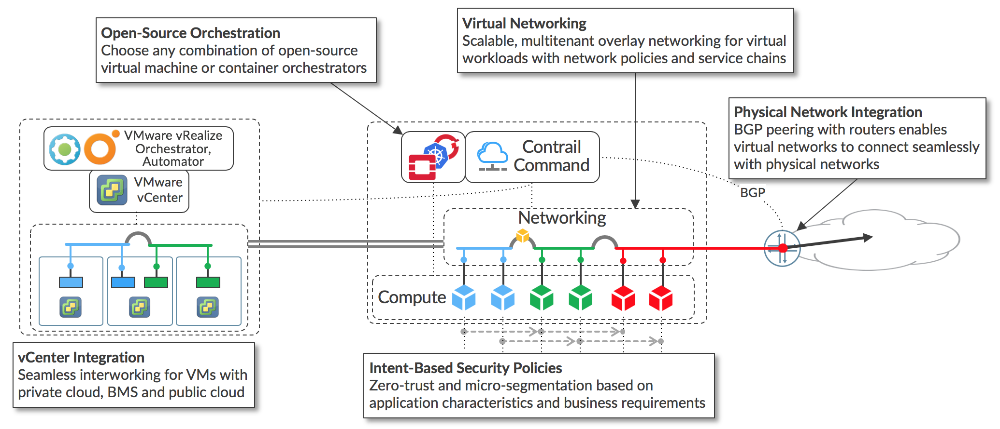
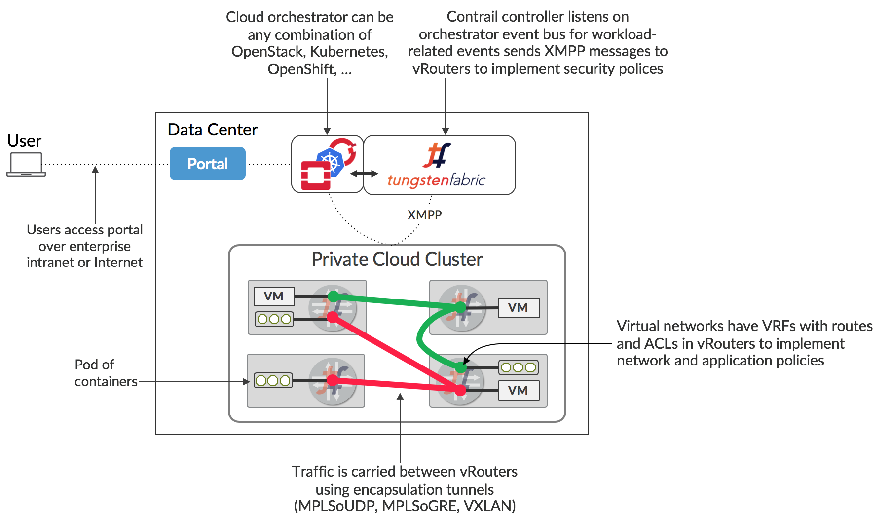
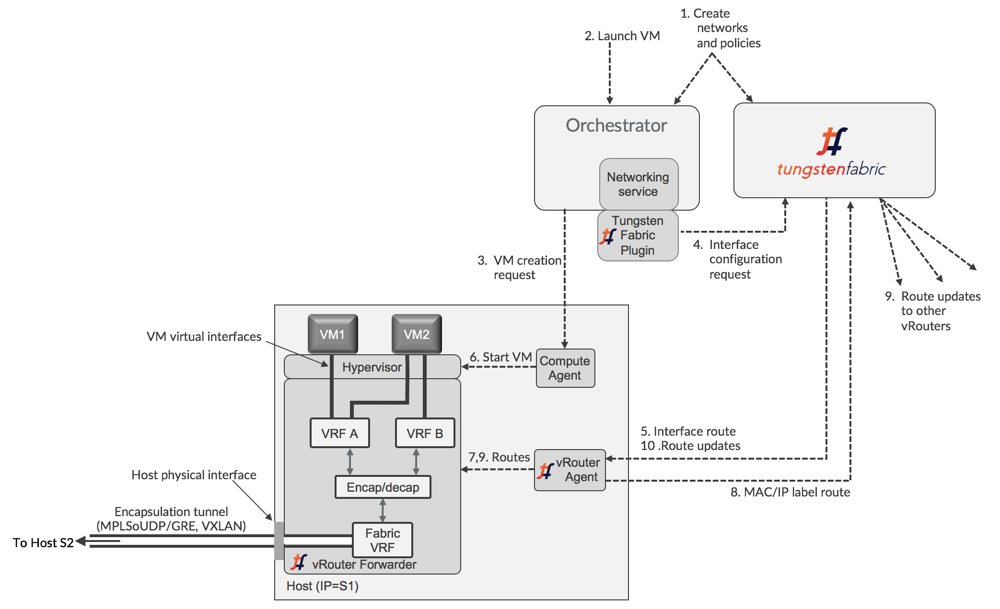
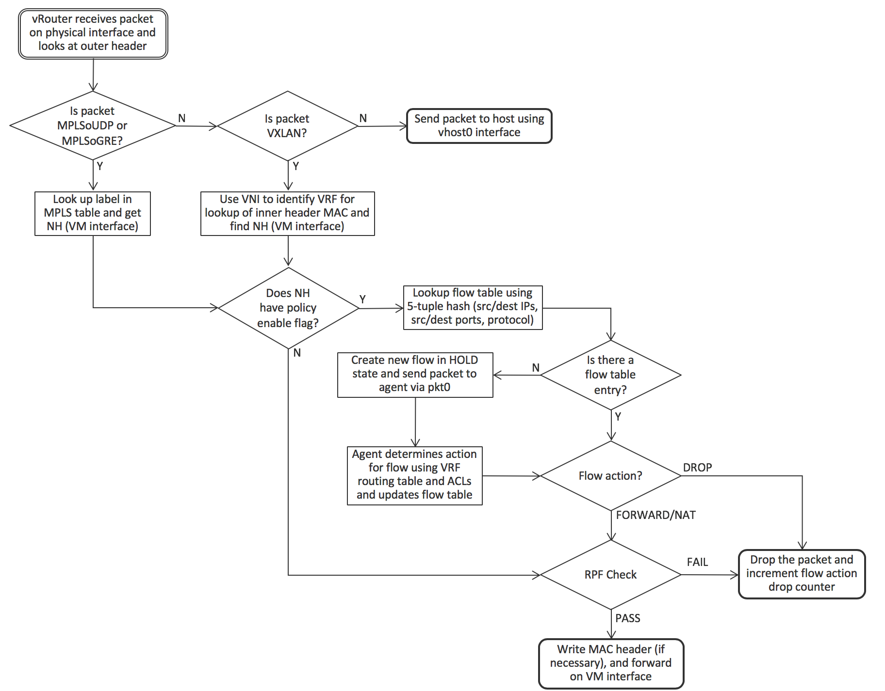

# Tungsten Fabric Architecture

### Introduction

Mô tả Tungsten Fabric cung cấp platform virtual networking có khả năng mở rộng làm việc với đa dạng VM và container orchestrator, có thể tích hợp với mạng vật lý và cơ sở hạ tầng tính toán. Tungsten fabric sử dụng chuẩn networking như BGP EVPN control plane và VXLAN overlay để kết nối liền mạch workload nởi orchestrator domain khác nhau (VM quản lý bởi VMware vCenter và container bởi Kubernetes).

Tungsten Fabric cung cấp một highly scalable virtual networking platform được thiest kế hỗ trợ multi-tenant network trong các môi trường lơn nhất trong khi hỗ trợ đồng thời nhiều orchestrator.

Vì có rất ít datacenter triển khai thực sự "greenfield", gần như luôn có yêu cầu tích hợp workload đã triển khai trên cơ sở hạ tầng mới với workload và mạng được triển khai trước nó. Sau đây mô tả tập hợp các kịch bản cho triển khai new cloud infrastructure sẽ được triển khai và nơi các cơ sở hạ tầng đã có.

### Use Cases

- Enable Platform-as-a-Service và Software-as-a-Service với khả năng mở rộng và mềm dẻo cao trong các datacenter được quản lý bởi OpenStack
- Virtual networking với hệ thống quản lý bở Kubernete container bao gồm Red Hat OpenShift
- Cho phép môi trường ảo(mới hoặc exist) chạy trên VMware vCenter sử dụng Tungsten Fabric virtual networking giữa các VM
- Kết nối Tungsten Fabric virtual network tới mạng vật lý sử dụng gateway router với BGP peering với networking overlay và trực tiếp thông qua mạng bên dưới data center

Các use case có thể được triển khai trong bất kỳ sự kết hợp để quyết định yêu cầu đặc biệt trong nhiều trường hợp triển khai. Các thuộc tính chính của Tungsten Fabric được minh họa như sau:

- Virtual networking sử dụng encapsulation tunnel giữa các virtualize host
- Plugin cho open-source orchestrator cho các VM và container
- Các chính sách an toàn dựa trên ứng dụng theo tag
- Tích hợp VMware orchestration stack
- Kết nối tới external network sử dụng BGP, SNAT và thông qua overlay network

Vì cùng controller và thành phần chuyển tiếp được sử dụng trong mọi thực hiện, Tungsten Fabric cung cấp một giao diện thống nhất để quản lý connectivity trong tất cả  môi trường support, có thể kết nối liền mạch giữa workloads được quản lý bởi các orchestrator khác nhau, dù VM hay container và tới đích trong external network.

### Key Features of Tungsten Fabric

Tungsten Fabric quản lý và thực hiện virtual networking trong môi trường cloud sử dụng OpenStack và Kubernete orchestrator. Tungsten Fabric sử dụng overlay netwok giữa vRoutes chạy trên mỗi host. Nó đã được chứng minh, công nghệ mạng dựa trên chuẩn ngày nay hỗ trợ mạng diện rộng của đa số nhà cung cấp dịch vụ trên thế giới, nhưng tái sử dụng để làm việc với virtualize workload và cloud automation trong data center có thể bao gồm từ phạm vi trung tâm dữ liệu quy mô lớn tới telco POPs nhỏ hơn. Nó cung cấp nhiều tính năng tăng cường qua thực hiện native networking của orchestrator bao gồm:

- Highly scalable, multi-tenant networking
- Multi-tenant IP address management
- DHCP, ARP proxies to avoid flooding into networks
- Efficient edge replication for broadcast and multicast traffic
- Local, per-tenant DNS resolution
- Distributed firewall with access control lists
- Application-based security policies
- Distributed load balancing across hosts
- Network address translation (1:1 floating IPs and distributed SNAT)
- Service chaining with virtual network functions
- Dual stack IPv4 and IPv6
- BGP peering with gateway routers
- BGP as a Service (BGPaaS) for distribution of routes between privately managed customer networks and service provider networks

## How Tungsten Fabric Works

### Tungsten Fabric Working with An Orchestrator

Tungsten Fabric controller tích hợp với cloud management system như OpenStack hoặc Kubernete. Chức năng của nó đảm bảo khi VM hoặc container được tạo, nó cung cấp kết nối mạng theo network và security policy trong controller hoặc orchestrator.
Tungsten Fabric bao gồm hai phần chính:
- Tungsten Fabric Controller: tập dịch vụ phần mềm chứa model của network và network policy, thường chạy trên một ít server high availability
- Tungsten Fabric vRouter: cài đặt trên mỗi host (VM hoặc container), vRouter xử lý packet forwarding và thực hiện chính sách mạng và bảo mật.

Triển khai chung của Tungsten Fabric như sau:

Tungsten Fabric controller tích hợp với một orchestrator qua một software plugin thực hiện networking service của orchestrator. Vd: Tungsten Fabric plugin cho OpenStack thực hiện Neutron API và kube-network-manager và các thành phần CNI (container network interface) lắng nghe sự kiện mạng liên quan sử dụng Kubernete k8s API.
Tungsten Fabric vRouter thay thế Linux bridge và IP table hoặc Open vSwitch networking trên compute host, và controller cấu hình vRouter để thực hiện chính sách mạng và bảo mật mong muốn.

Packet từ VM trên một host có đích chạy trên host khác được đóng gói MPLS qua UDP/GRE hoặc VXLAN, địa chỉ đích là địa chỉ VM trong outer header. Controller có trách nhiệm cài đặt tập đường đi trong mỗi VRF của vRouter thực hiện chính sách mạng. Mặc định, VM trong cùng mạng có thể giao tiếp với nhau. Các VM trong mạng khác nhau giao tiếp được với nhau chỉ khi được cho phép trong chính sách mạng. Giao tiếp giữa controller và vRouter thông qua XMPP, một messaging protocol được sử dụng rộng rãi và linh hoạt. 

User có thể request tài nguyên cho ứng dụng mà không cần biết chi tiết tài nguyên được cung cấp thế nào, ở đâu. Điều này được thực hiện thông qua một cổng chỉ định một tập các service đáp ứng từ lựa chọn người dùng, tạo thành API call hệ thống bên dưới bao gồm cloud orchestrator để spin up VM hoặc container với memory, disk, CPU cần thiết cho yêu cầu của user. Cung cấp dịch vụ đơn giản như một VM với memory, disk và CPU chỉ định cho VM có thể bao gồm toàn bộ application stack gồm nhiều software instance được cấu hình sẵn.

### Interaction With An Orchestrator 

Kiến trúc của Tungsten Fabric controller và vRouter và tương tác với orchestrator thể hiện như sau:

Mỗi interface của workload chạy trên host được kết nối tới một VRF chứa L2 và L3 forwarding table cho mạng tương ứng chứa địa chỉ IP của các interface. vRouter thực hiện chức năng Integrated Bridgine và Routing (IRB) thay cho các router vật lý. Một vRouter chỉ chứa các VRF cho mạng có interface trên host, bao gồm Fabric VRF kết nối tới physical interface của host. Sử dụng VRF cho phép mạng ảo khác overlapping IP và địa chỉ MAC, không cung cấp chính sách mạng được định nghĩa để cho phép traffic giữa chúng. Tungsten Fabric virtual networking sử dụng đường hầm đóng gói để vận chuyển packet giữa các different host, việc encap và decap xảy ra giữa Fabric VRF và VM VRF.

Khi một new virtual workload được tạo, một sự kiện được xem bởi plugin orchestrator chỉ định và gửi tới controller, controller gửi request tới agent cho định tuyến được cài đặt trong VRF cho virtual network, sau đó agent cấu hình chúng trong forwarder.
Luồng cấu hình networking trên một VM mới với một single interface:
- 1. Network và network policy được xác định orchestrator hoặc Tungsten Fabric sử dụng UI, CLI hoặc REST API. Một network được xác định như pool IP address sẽ được cấp phát interface khi VM được tạo.
- 2. Yêu cầu chạy VM bởi user của orchestrator bao gồm network interface
- 3. Orchestrator chọn một host cho new VM, yêu cầu compute agent trên host fetch image VM và start.
- 4. Tungsten Fabric plugin nhận sự kiện hoặc API call từ networking service của orchestrator tạo hướng dẫn setup networking cho VM sẽ được start. Các hướng dẫn chuyển thành Tungsten Fabric REST call và gửi tới Tungsten Fabric controller
- 5. Tungsten Fabric controller gửi request tới vRouter agent cho new VM virtual interface để kết nối tới virtual network chỉ định. vRouter agent hướng dẫn vRouter Forwarder để kết nối VM interface tới VRF cho virtual network. VRF được tạo, kết nối tới interface
- 6. Compute agent start VM, yêu cầu IP cho mỗi interface VM sử dụng DHCP. vRouter proxy DHCP request và trả lời với interface IP, default gateway và địa chỉ DNS server.
- 7. Một khi interface active và có địa chỉ IP từ DHCP, vRouter sẽ cài đặt đường đi tới địa chỉ IP của VM và địa chỉ MAC với một next hop của VM virtual interface.
- 8. vRouter chỉ định label cho interface và cài một label route trong MPLS table. vRouter gửi thông điệp XMPP tới controller chứa một route tới new VM. Route có nex hop của địa chỉ IP của server vRouter chạy trên đó, chỉ định giao thức đóng gói sử dụng label đã được chỉ định.
- 9. Controller phân tán đường đi tới new VM cho các vRouter khác với VM trong cùng mạng và trong mạng khác được cho phép bởi chính sách mạng.
- 10. Controller gửi các route cho các VM khác theo policy tới vRouter của Vm mới.
### Architecture Details of vRouter

vRouter agent chạy trên user space của host. Forwarder có thể chạy như một kernel module, trong user space (DPDK), trong network interface card (smart NIC). 

Agent chứa session với controller, gửi thông tin VRF, route, ACL lưu trữ trên database của nó; sử dụng thông tin cấu hình Forwarder. Interface kết nối tới các VRF, forwarding information base (FIB) trong mỗi VRF được cấu hình với forwarding entry.

Mỗi VRF chứa forwarding và flow table chính nó, MPLS và VXLAN table trong vRouter. Forwarding table chứa route cho cả IP và MAC, kết hợp IP-to-MAC cung cấp ARP. Giá trị của nhãn trong MPLS table được chọn bởi vRouter khi VM interface chỉ định bởi vRouter. VXLAN Network Identifer trên tất cả VRF cùng virtual network trong các vRouter khác cùng Tungsten Fabric domain.

Mỗi virtual network có một default gateway, mỗi VM hoặc container interface nhận địa chỉ trong DHCP responsevkhi khởi tạo. Khi workload gửi packet tới địa chỉ ngoài mạng con của nó, gói tin ARP với MAC kết hợp địa chỉ IP của gateway, vRouter phản hồi MAC của nó. vRouter hỗ trợ đầy đủ chức năng default gateway phân tán cho tất cả virtual network.
### Detailed Packet Processing Logic in a vRouter 

- Flow packet từ VM tới VM khác

  - VM interface gửi packet tới vRouter Forwarder 
  - Kiểm tra packet có trong flow table của VRF không qua 5-tuple: source and dest IP, source and dest port TCP hoặc UDP, protocol
  - Nếu packet là một flow table entry kiểm tra action của flow 
  - Nếu packet không khớp với flow table entry, forwarder gửi packet tới vRouter agent qua pkt0, vRouter agent xác định action cho flow dựa vào VRF routing table và ACL, update flow table theo kết quả
  - Action flow có thể là DROP, FORWARD, NAT hoặc MIRROR.
  - Nếu packet được forward, vRouter forwarder kiểm tra MAC đích với địa chỉ MAC chính nó. MAC đích khớp với MAC vRouter, trong trường hợp VM gửi packet tới default gateway khi địa chỉ đích bên ngoài subnet VM, quá trình định tuyến dựa vào IP forwarding table. Nếu không khớp, địa chỉ MAC address sử dụng để tìm kiếm. vRouter thực hiện IRB (Integrated Routing and Bridginng) của router vật lý bên trong compute node.
  - Packet thêm trường encapsulation và gửi tới physical interface 

- Flow packet từ mạng vật lý

  - vRouter nhận packet từ mạng vật lý, vRouter kiểm tra packet có được đóng gói hay không
  - Packet không được đóng gói sẽ gửi tới máy host sử dụng vhost0 interface
  - Packet đóng gói MPLS qua UDP hoặc MPLS qua GRE, tìm kiếm label packet trong MPLS table; nếu packet là gói tin VXLAN sử dụng VNI xác định VRF tìm kiếm MAC đích trong inner header
  - Khi interface được xác định, vRouter có thể chuyển tiếp packet nếu  policy flag không được set cho interface (tất cả giao thức và TCP/UDP port đều được phép)
  - Nếu policy flag được set, packet sẽ chuyển tiếp giống như luồng packet bên trên
  - Cuối cùng viết MAC header và chuyển tiếp packet tới VM interface 

### Packet Flow Between VMs In The Same Subnet

2 VM đã được khởi động, Controller đã gửi L2 và L3 route tới tất cả vRouter để cho phép giao tiếp giữa các VMs. VM lần đầu gửi data tới VM khác, cần phân giải định danh qua DNS.

1. VM1 gửi packet tới VM2, trước hết cần biết địa chỉ IP của VM2, không có địa chỉ IP của VM2 trong DNS cache
2. VM1 gửi DNS request tới địa chỉ DNS server được cung cấp trong DHCP response khi up interface
3. vRouter nhận DNS request và chuyển tiếp tới DNS server chạy trong Tungsten Fabric controller
4. DNS server trong controller phản hồi địa chỉ IP của VM2
5. vRouter gửi DNS reponse cho VM1
6. VM1 gửi packet cho VM2 cần địa chỉ MAC của VM2 để điền Ethernet frame. VM1 kiểm tra ARP cache không tìm thấy MAC của VM2
7. VM1 gửi ARP request
8. vRouter nhận ARP request và tìm kiếm địa chỉ MAC khớp với IP  VM2 trong forwarding table và tìm trong L2/L3 routes mà controller gửi cho VM2
9. vRouter gửi ARP reply cho VM1 với MAC của VM2
10. TCP timeout trong network stack VM1
11. Network stack VM1 gửi lại packet, với MAC VM2 từ ARP cache, tạo Ethernet frame và gửi đi
12. vRouter tìm kiếm MAC của VM2 và tìm encapsulation route. vRouter tạo outer header và gửi packet tới S2.
13. vRouter trên S2 nhận packet, tìm kiếm MPLS label để định danh virtual interface để gửi gói tin Ethernet gốc. Ethernet frame gửi tới interface và nhận bởi VM2.

